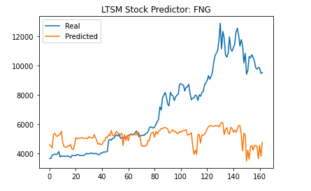

# LTSM STOCK PREDICTOR

Crypto Fear and Greed Index (FGN) is an indicator investors commonly use to incorporate sentiment analysis from social media and news articles into their trading strategies. 

Starting in file "ltsm_stock_predcitor_closing" we will look at LTSM RNN (Long Short Term Memory Recurring Neural Network) data. This data learns long term dependencies through additional layers in the repeating model rather than a single layer as in a typical RNN. 
1. Prepare the both sentiment and closing price .csv files.  
    2. Join the data into a single DataFrame 
    3. Define a function "window_data" to return an array of X and y values. 
    4. Pick a window size of how many days of pervious closing prices to use. Index into the "window_data" function.
    5. Split the data 70% into training data and 30% into testing data. 
    6. Fit the data using sklearn MinMaxScaler
2. Build and Train LSTM RNN using tensorflow
    3. Build 4 layers of the repeating model --> compile using Keras "adam" optimizer. 
    4. Summarize the model and fit the data. Epoch = how many times you go through the training data. Lower batch size recommended as it is the number of samples used to estimate the error. 
3. Evaluate Model Performance 
    4. Evaluate X and y test data. Make precitions from the X test data. 
    5. Use inverse_transform to recover the actual closing prices. 
    6. Create a dataframe to compare Real vs. Predicted values and plot. 
4. Repeat steps for "ltsm_stock_predictor_fng". 

### Loss
LTSM Stock Predictor using FNG data had a higher loss than using closing prices. This loss translates into the vast separation between Real and Predicted values as shown clearly by the plot. 

LTSM Stock Predictor using Closing data had much less variance between the real and predicted values, as well as a much lower loss. The predicted values are lower than the actual, but follow along roughly the same pattern as actual data. 

### Window Size
As the window size increased from 1-10, the predicted values smoothed. 
For the FNG Data, a window size of 5 allowed better visualization of potential dips in the stock value. It did not account for spikes. 

For the Close Data, an increase in window size to 5 proved to take away too much variance in the predicted graph. Although it still showed the upward trend, various smaller increases and dips were not visible. CLOSE_

By the time both graphs reach a window size of 10, the use of the predicted trend line goes down drastically. For the FNG data, a window size near 5 is ideal. The Close data needs a smaller window size under 5 to be best beneficial to the user. 
